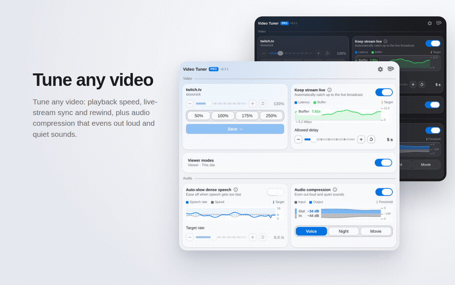

# Video Tuner Pro

Take control of any video on the web. Set the playback speed, pop it into Viewer
or Theater mode, keep live streams on the live edge, and even out loud and quiet
sounds — all from one little popup. Works on virtually any site, in light and dark
themes, in 10 languages, with no accounts and no tracking.

## Install

- **Chrome / Edge / Brave:** [Chrome Web Store](https://chromewebstore.google.com/detail/video-tuner-pro/ichlipldofdemkhlhnoekfkpfejfanno)
- **Firefox:** [Firefox Add-ons](https://addons.mozilla.org/ru/firefox/addon/video-tuner-pro/)

## What it does

- **Playback speed** — editable presets or a fine slider, on almost any video. Set your own preset values and raise the maximum speed as high as you need.
- **Remember speed per channel, site, or globally** — save a speed for a detected channel, the current site, or as a global default; it's applied automatically next time, by priority (channel → site → global). Anything not saved stays at normal speed.
- **Keyboard shortcuts** — slower, faster, and reset keys, a hold-to-speed key, and a key per preset — all remappable to chords of your choice.
- **Live-sync** — automatically catches live streams back up to the live edge, then returns to normal.
- **Rewind live streams** — scrub back and watch the recording at any speed; return to the live edge and it's a live stream again.
- **True latency** — see the real delay to the broadcaster on YouTube and Twitch, not just the buffer.
- **Audio compression** — evens out loud and quiet parts so you don't keep reaching for the volume. Voice, Night, and Movie presets, or fine-tune every knob.
- **Auto-slow dense speech** — temporarily eases the playback rate when speech becomes too dense, then smoothly returns to your chosen speed.
- **Viewer, Theater, and Picture-in-Picture** — move the active video into a focused glass viewer, fill the window, or hand it to the browser's native PiP. Viewer behavior and fit can be remembered by channel, site, or globally.
- **Player quality control** — the Viewer exposes Auto and fixed quality choices when the underlying player makes them available, without replacing the player or its media source.
- **Super theater (YouTube)** — one toggle makes theater mode fill the whole window; the header hides itself.
- **On-video readout** — optional badge showing the current speed and how much time is really left at that speed.
- **Live graphs** — see the audio levels and the live-stream buffer in real time.
- **Light & dark themes**, 10 languages, and **no tracking**. SponsorBlock markers (when enabled or detected from a compatible extension) query SponsorBlock with the current YouTube video ID; all other processing stays in the browser.

## How to use

1. Open a page with a video and click the extension icon.
2. Drag the slider or pick a preset — the speed changes instantly. The toolbar icon shows the current speed.
3. Pick a scope — **Global**, **Site**, or **Channel** (when a stable channel identity is available) — and click **Save** to keep that speed; **Reset** forgets the saved value for that scope. The ⟲ button by the readout (or the **R** key) drops a manual change and re-applies the saved speed without deleting anything.

Turn on **Show speed & time on video** to see the speed and the real remaining
time right on the player — it appears when you move the mouse and fades away on
its own.

## Live streams

On a live stream (YouTube Live, Twitch, etc.) the manual speed controls are off —
changing speed wouldn't make sense for a live broadcast. Instead, turn on
**Live-sync**:

- If you drift behind the live broadcast (after a pause, a stall, or switching
  tabs), it speeds up just enough to catch back up, then returns to normal.
- Two settings: **Allowed delay** (how far behind to tolerate) and **Buffer
  reserve** (how much buffered media to keep while catching up).

## Audio compression

Turn it on to make quiet parts more audible and stop loud parts from blasting —
great for movies with whispery dialogue and explosive action, or noisy streams.
You can fine-tune it or just leave the defaults, and a live meter shows the
effect. On a few sites the browser blocks audio processing, and the extension
will tell you when that happens.

## Privacy

No accounts or analytics. Settings can sync through your own browser profile,
and categories can be kept on-device instead. Optional SponsorBlock markers send
only the current YouTube video ID and selected segment categories to SponsorBlock.
See [PRIVACY.md](PRIVACY.md).

## License

[GPL-3.0](LICENSE) © slonick.dev

Free to use, study, modify and share. If you distribute a modified version —
including publishing a fork to a store — it must stay open source under the same
GPL-3.0 license.
